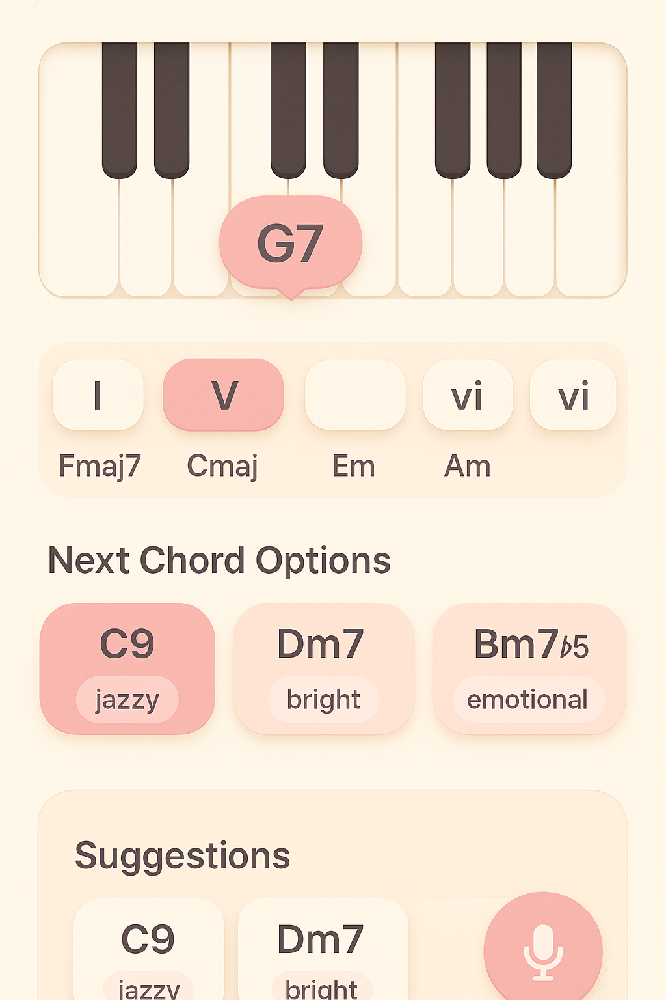
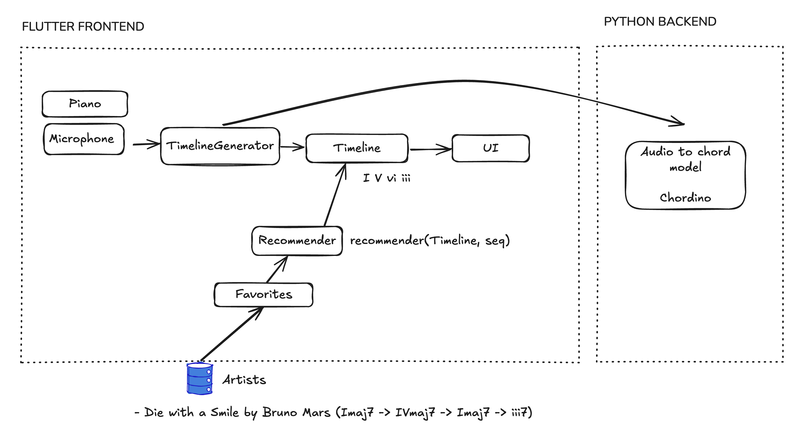

# harmoniq

New consideration: Create a mobile app, ditch the MIDI.

Application Homepage concept




System design architecture diagram



In terms of the backend, we have 


live_chord_recognizer.py - this file is the base technology that converts a session to a music t
live_chord_progression.py - this version also includes showing the chord progression at the end of the session

after contemplating between writing this project in React Native or Flutter I have devided to use flutter as it is better suited for MVPs, it has a growing support for lower latency real time audio, it has a custom expressive UI since Flutters widget system is perfect for drawing chord graphs, timelines, etc. It's also a strong cross platform choice as it can run on iOS, ANdroid, desktop, and web.


**If you want to run the current web version, go to the web folder and follow the instructions in the README there.**

Harmoniq is a tool for aspiring pianists who want to improvise/compose, and familiarize themselves with music theory in an interactive and synergistic way. It's kind of like auto-complete but for chords. Many composers, cover artists, and improvisers rely heavily on playing by ear. However, they hit a bottleneck when trying to: 
- Reproduce harmonic combinations they imagine
- Understand or recall what they just played 
- Explore better sounding alternatives grounded in music theory

People talk about hand-eye coordination; this tool helps with about ear-music coordination. 

This is a tool for beginner-intermediate composers, basically for people who are not still able to train that ear-chord muscle or are not super familiar with the music theory names. Harmoniq will help you be able to reproduce all the chords you are playing. Even for more experienced users, Harmoniq can help you 

There is a huge passionate community of composers and aspiring pianists on YouTube that create amazing compositions, and they will be the clients for Harmoniq. 

## Key Features
1. **Interactive piano visualization**: Displays currently played notes and chord interpretation in real-time.
  - **Live chord detection and visualization**: I want to make a real-time music assistant that listens to your piano (via audio or MIDI input), detects and visualizes chords as you play, and learns your preferred dimensions of music: chord progressions, harmonic tendencies over time, voice arrangement (bass, alto, tenor). 
2. **Timeline view and Chord-Autocomplete**: Scrollable view of past chords, showing progression and voice movement. 
	- It can generate suggested harmonic combinations. 
	- Next Step: Shows alternative voicings or next chord options at a section of the web interface. 
3. A **"favorites" list** can be saved, where the musical dimensions of those songs can be clearly displayed and recommended as you play. This can be stored in a simple database. 
   - Example: Die with a Smile by Bruno Mars (Imaj7 -> IVmaj7 -> Imaj7 -> iii7)
   - Next Step: This favorites list can do something like "Bruno Mars would often use this chord progression"! 

## Database 

Store favorites songs list per user. 

## Technology
This would require a converter from MIDI/Audio -> Harmonic Progressions.
- Using Klangio (expensive)
- Open source
  - (Essentia)[https://essentia.upf.edu/documentation.html]


## Tech stack

For this project, in terms of development, I would like to use sort of a minimalistic stack.
- Frontend: HTML, CSS, TypeScript. 
- Backend: Server side applications using Node.js with - Express. 
- Host Application: Single Ubuntu VPS using Nginx as the web server. 
- Database: Perhaps JSON files over traditional databases. 
- Dev Tools: Figma, ensure responsiveness using Chrome's emulation features. 


## Progress

### Current Implementation Status (as of April 18, 2024)
- Basic project structure and development environment setup
- Express.js server with TypeScript configuration
- Initial HTML template with basic styling
- Development scripts for building and running the application

A screenshot of what the 'homepage' looks like currently:


### Running the Application

1. **Prerequisites**
   - Node.js (v16 or higher)
   - npm (Node Package Manager)

2. **Installation**
   ```bash
   # Clone the repository
   git clone https://github.com/mtaruno/harmoniq.git
   cd harmoniq

   # Install dependencies
   npm install
   ```

3. **Development Mode**
   ```bash
   # Start the development server with hot reloading
   npm run dev
   ```
   The application will be available at `http://localhost:3000`

It will try to connect to your keyboard, and you can play a chord and it will display it! 

4. **Production Build**
   ```bash
   # Build the TypeScript files
   npm run build

   # Start the production server
   npm start
   ```

### Next Steps
- Implement interactive piano keyboard interface
- Add real-time chord detection
- Create timeline view for chord progression
- Develop favorites system

## Development Timeline

### Phase 1: Core Piano Interface (Weeks 1-2)
- **Week 1: Basic Piano Visualization**
  - Implement interactive piano keyboard with mouse and keyboard controls
  - Create visual feedback for pressed keys
  - Set up basic note-to-frequency conversion

- **Week 2: Chord Detection System**
  - Implement chord pattern recognition algorithms
  - Create chord type detection (major, minor, 7th, etc.)
  - Develop real-time chord display

### Phase 2: Timeline and Progression Features (Weeks 3-4)
- **Week 3: Timeline Implementation**
  - Create scrollable timeline view of played chords
  - Implement chord history tracking
  - Add timestamp functionality for each chord

- **Week 4: Chord Progression Analysis**
  - Develop chord progression detection
  - Implement voice leading visualization
  - Create harmonic tendency analysis

### Phase 3: Favorites and Storage (Weeks 5-6)
- **Week 5: Favorites System**
  - Implement favorites list functionality
  - Create UI for managing saved progressions
  - Add ability to name and categorize favorites

- **Week 6: Data Persistence**
  - Set up local storage for favorites
  - Implement data export/import functionality
  - Create backup and restore features

### Phase 4: Advanced Features (Weeks 7-8)
- **Week 7: Alternative Voicings**
  - Implement chord voicing suggestions
  - Create alternative chord progression recommendations
  - Develop voice arrangement visualization

- **Week 8: Audio Input Integration**
  - Research and implement audio input processing
  - Integrate with Essentia.js for audio analysis
  - Create MIDI input support

### Phase 5: Polish and Deployment (Weeks 9-10)
- **Week 9: UI/UX Refinement**
  - Improve responsive design
  - Enhance visual aesthetics
  - Optimize performance

- **Week 10: Deployment and Documentation**
  - Set up production environment
  - Deploy to VPS with Nginx
  - Complete user documentation
  - Prepare for public release

### Contact Information
mtaruno@uw.edu
