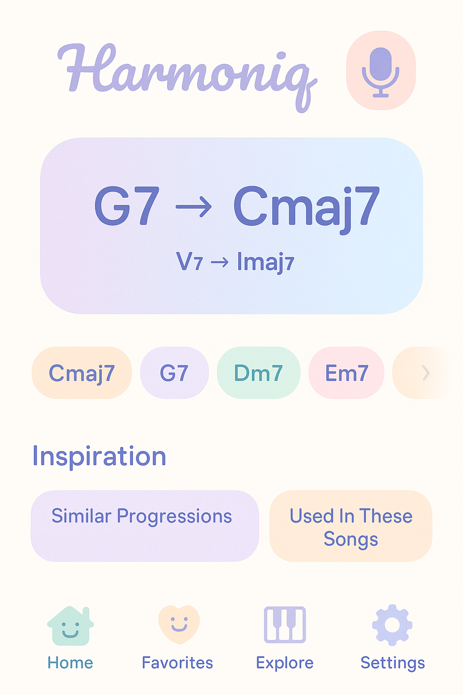

# harmoniq


### What is Harmoniq? 


Harmoniq is a tool for aspiring pianists who want to improvise/compose, and familiarize themselves with music theory in an interactive and synergistic way. It's kind of like auto-complete but for chords. Many composers, cover artists, and improvisers rely heavily on playing by ear. However, they hit a bottleneck when trying to: 
- **Reproduce** harmonic combinations they imagine
- **Understand** or **recall** what they just played 
- Explore "better sounding alternatives" grounded in music theory and stuff that the whole community of artists like on YouTube have created. There is a huge passionate community of composers and aspiring pianists on YouTube that create amazing compositions, and they will be the clients for Harmoniq. 


People talk about hand-eye coordination; this tool helps with about ear-music coordination. This is a tool for beginner-intermediate composers, basically for people who are not still able to train that ear-chord muscle or are not super familiar with the music theory names. Harmoniq will help you be able to reproduce all the chords you are playing. Even for more experienced users, Harmoniq can help you.


## How to Use Harmoniq? 

We begin by starting your session by clicking START, which activates the microphone and starts listening for incoming music being played. In the meanwhile, run `python live_chord_recognizer.py` to start the chord recognizer and `python live_chord_progression.py` to start the chord progression analyzer.

Note to TA: As of the current period, the front end has not been created so please test the live chord progression Python file to get a feel for how the application is going to work. That already works successfully. To test if the function works, feel free to choose any YouTube piano song and then see if it can detect the chords correctly, it should work!

A real-time music assistant (implemented in `live_chord_detector.py`) listens to your piano via audio, detects and visualizes chords as you play (demo of this is shown in `live_chord_progression.py`) and figures out the chords you are playing at any given time window (I have set it to every ~2 seconds). 

When we end the session, a Session Report is made that displays the chords that you have played over your session (it only includes the chords it is more than ~80% confident in). 

I have also implemented a Key Signature classifier in `live_chord_progression.py`. Because we have a best guess of what the key signature is based on what you played in the session, harmonic progression roman numerals can also be displayed. 


Future implementations can also include other dimensions of music such as harmonic tendencies over time, voice arrangement (bass, alto, tenor). The problem right now is that the algorithm is not perfect, so it is more useful as a display currently rather than something 100% accurate. 


A **"favorites" list** can be saved, where the musical dimensions of those songs can be clearly displayed and recommended as you play. This can be stored in a simple database. For example, for Die with a Smile by Bruno Mars (Imaj7 -> IVmaj7 -> Imaj7 -> iii7)

Because we have the Session Report and Favorites List, a cool feature idea would be to cross reference the Session Report to the Favorites list to display something like "Bruno Mars would often use this chord progression Imaj7 -> IVmaj7!" which would hopefully ground your compositions to your favorite artists. 

As for the front end, I envision having a mic button that has "START SESSION" or something like that on it. Then when the session starts, this is the information that shows (but make it more suitable following UX principles to be displayed well in the front end)
```
🎼 Live Chord Progression Detector
==================================================
🎼 REAL-TIME HARMONIC PROGRESSION ANALYZER
============================================================
🎹 Play chords clearly and hold them
🔍 Automatic key detection
📊 Timeline will be shown at session end
🎵 Pattern recognition
🎤 Using 1 channel audio input
⏹️  Press Ctrl+C to exit and see timeline
============================================================
Available audio devices:
   0 Matthew’s iPhone Microphone, Core Audio (1 in, 0 out)
   1 BlackHole 16ch, Core Audio (16 in, 16 out)
   2 BlackHole 2ch, Core Audio (2 in, 2 out)
>  3 MacBook Pro Microphone, Core Audio (1 in, 0 out)
<  4 MacBook Pro Speakers, Core Audio (0 in, 2 out)
   5 Microsoft Teams Audio, Core Audio (1 in, 1 out)
   6 Omnibus A, Core Audio (16 in, 16 out)
   7 Omnibus B, Core Audio (16 in, 16 out)
   8 Descript Loopback Recorder, Core Audio (2 in, 2 out)
   9 ZoomAudioDevice, Core Audio (2 in, 2 out)
  10 Quicktime Player Input, Core Audio (16 in, 16 out)
  11 Screen Record W/ Audio, Core Audio (0 in, 2 out)
  12 MAIN Volt 276, Core Audio (0 in, 2 out)
  13 Maxies + BlackHole, Core Audio (0 in, 2 out)
  14 Speakers + BlackHole, Core Audio (0 in, 2 out)
--------------------------------------------------
Using input device with 1 channel(s)
🎵 Fmaj7    | Conf: 0.63 | Vol: 0.018
🎵 Fmaj7    | Conf: 0.62 | Vol: 0.035
🎵 Fmaj7    | Conf: 0.62 | Vol: 0.042
🎵 C7       | Conf: 0.64 | Vol: 0.039
🎵 C7       | Conf: 0.60 | Vol: 0.036
🎵 Cm7      | Conf: 0.62 | Vol: 0.031
🎵 Am7      | Conf: 0.67 | Vol: 0.054
🎵 A        | Conf: 0.75 | Vol: 0.092
🎵 Am7      | Conf: 0.75 | Vol: 0.090
🎵 Dm       | Conf: 0.81 | Vol: 0.051
🗝️  Key detected: C major
🎵 Dm7      | Conf: 0.76 | Vol: 0.051
🎵 Dm7      | Conf: 0.72 | Vol: 0.069
🎵 C7       | Conf: 0.69 | Vol: 0.081
🎵 C7       | Conf: 0.80 | Vol: 0.070
🎵 Cmaj7    | Conf: 0.79 | Vol: 0.051
🎵 C#dim    | Conf: 0.86 | Vol: 0.046
🎵 C#dim    | Conf: 0.72 | Vol: 0.023
🎵 C7       | Conf: 0.60 | Vol: 0.039
🎵 Fmaj7    | Conf: 0.65 | Vol: 0.047
🎵 Fmaj7    | Conf: 0.74 | Vol: 0.040
🎵 Fmaj7    | Conf: 0.63 | Vol: 0.025
🎵 Dm7      | Conf: 0.64 | Vol: 0.045
🎵 Dm7      | Conf: 0.72 | Vol: 0.062
🎵 Cmaj7    | Conf: 0.72 | Vol: 0.066
🎵 Cmaj7    | Conf: 0.74 | Vol: 0.053
🎵 Cmaj7    | Conf: 0.69 | Vol: 0.068
🎵 A        | Conf: 0.73 | Vol: 0.088
🎵 Am7      | Conf: 0.75 | Vol: 0.079
🎵 Dm       | Conf: 0.79 | Vol: 0.056
🎵 Dm7      | Conf: 0.78 | Vol: 0.046
🎵 Dm7      | Conf: 0.75 | Vol: 0.057
🎵 Cmaj7    | Conf: 0.70 | Vol: 0.070
🎵 Cmaj7    | Conf: 0.78 | Vol: 0.068
🎵 C7       | Conf: 0.72 | Vol: 0.057
🎵 C#dim    | Conf: 0.75 | Vol: 0.049
🎵 Edim     | Conf: 0.67 | Vol: 0.044
🎵 C7       | Conf: 0.63 | Vol: 0.050
```


```
================================================================================
🎼 HARMONIC PROGRESSION SESSION SUMMARY
================================================================================
⏰ Session Duration: 31.0 seconds
🎹 Total Chords Detected: 17
🎵 Unique Chords: 8
🗝️  Detected Key: C major (confidence: 76%)
📋 Diatonic chords: C - Dm - Em - F - G - Am - Bdim

⏱️  CHORD PROGRESSION TIMELINE:
----------------------------------------------------------------------
Chords:    A  Am7 Dm  Dm7  C7  Cmaj7  C#dim  Fmaj7 Dm7 Cmaj7  A  Am7 Dm  
Roman:    (A) vi7 ii  ii7  I7  IM7 (C#dim) IVM7 ii7 IM7  (A) vi7 ii  
Duration: 0.8s 0.8s 0.7s 2.3s  0.8s 0.8s 3.7s     2.2s  0.9s 2.2s  0.7s 0.8s 0.8s 

Chords:   Dm7 Cmaj7 C7  C#dim 
Roman:    ii7 IM7 I7  (C#dim) 
Duration: 1.5s 1.4s 0.8s 2.1s  

📊 Visual Timeline:
      █ █ █ ██ █ █ ███ ██ █ ██ █ █ █ █ █ █ ██ 

🎵 PROGRESSION ANALYSIS:
----------------------------------------
📝 Full Progression: (A) → vi7 → ii → ii7 → I7 → IM7 → (C#dim) → IVM7 → ii7 → IM7 → (A) → vi7 → ii → ii7 → IM7 → I7 → (C#dim)

📈 Most Used Chords:
   Dm7 (ii7): 3 times
   Cmaj7 (IM7): 3 times
   A ((A)): 2 times
   Am7 (vi7): 2 times
   Dm (ii): 2 times

⏱️  Total Playing Time: 23.2 seconds
================================================================================

🎼 HARMONIC PROGRESSION ANALYSIS
==================================================

📝 Full Progression in C major:
   (A) → vi7 → ii → ii7 → I7 → IM7 → (C#dim) → IVM7 → ii7 → IM7 → (A) → vi7 → ii → ii7 → IM7 → I7 → (C#dim)

🎵 Chord Relationships:
   (A) → vi7
   vi7 → ii
   ii → ii7
   ii7 → I7
   I7 → IM7
   IM7 → (C#dim)
   (C#dim) → IVM7
   IVM7 → ii7
   ii7 → IM7
   IM7 → (A)
   (A) → vi7
   vi7 → ii
   ii → ii7
   ii7 → IM7
   IM7 → I7
   I7 → (C#dim)

🎼 Common Patterns Found:

📊 Chord Frequency:
   Dm7: 3 times (17.6%)
   Cmaj7: 3 times (17.6%)
   A: 2 times (11.8%)
   Am7: 2 times (11.8%)
   Dm: 2 times (11.8%)
   C7: 2 times (11.8%)
   C#dim: 2 times (11.8%)
   Fmaj7: 1 times (5.9%)

🎵 Session ended. Thank you for playing!
==================================================
```


I want the color and style to be cute. 


## Tech Stack

Initially I wanted to create a web interface. But in testing during actual piano playing sessions, it is not ergonomic to bring my laptop on top of the piano every time I want to have a composition seession. Because of this, I pivoted to create a mobile app. MIDI was also an initial plan, but using a microphone based system is more powerful for actual performers as I having to lug around a MIDI keyboard everywhere isn't as accessible. 

Application Homepage concept



System design architecture diagram (outdated at the moment)


## Algorithms

`live_chord_recognizer.py` - this file is the base technology that converts a music inside a session in real time into chords that it tries to predict every second and assigns a confidence score. 


`live_chord_progression.py` - This version extends the Chord Recognizer to display the *harmonic progression* at the end of the session


### How does Chord Recognizer work? 


### How does Chord Progression work?
First, we need to know the base key signature, so for this an algorithm is written to figure out the base key signature. From here, we take the chords in the session that has higher than 80% confidence to be included in the final harmonic progression we would like to display in the aplication. 


- **Real-time audio processing** via sounddevice + librosa
- **Chroma vector extraction** using `librosa.feature.chroma_cqt()`
- **Chord matching algorithm** with dot product similarity scoring
- **Dynamic key detection** from chord sequence analysis
- **Roman numeral conversion** (I, ii, iii, IV, V, vi, vii°)
- **Pattern recognition** for famous progressions


## Frontend 

After contemplating between writing this project in React Native or Flutter I have devided to use flutter as it is better suited for MVPs, it has a growing support for lower latency real time audio, it has a custom expressive UI since Flutters widget system is perfect for drawing chord graphs, timelines, etc. It's also a strong cross platform choice as it can run on iOS, Android, desktop, and web.


**If you want to run the current web version, go to the web folder and follow the instructions in the README there.**


## Progress Reports

### Current Implementation Status (as of April 18, 2024)
- Basic project structure and development environment setup
- Express.js server with TypeScript configuration
- Initial HTML template with basic styling
- Development scripts for building and running the application


A screenshot of what the 'homepage' looks like currently:


### Running the Application

1. **Prerequisites**
   - Node.js (v16 or higher)
   - npm (Node Package Manager)

2. **Installation**
   ```bash
   # Clone the repository
   git clone https://github.com/mtaruno/harmoniq.git
   cd harmoniq

   # Install dependencies
   npm install
   ```


3. **Development Mode**
   ```bash
   # Start the development server with hot reloading
   npm run dev
   ```
   The application will be available at `http://localhost:3000`

It will try to connect to your keyboard, and you can play a chord and it will display it! 

4. **Production Build**
   ```bash
   # Build the TypeScript files
   npm run build

   # Start the production server
   npm start
   ```
## Development Timeline

### Phase 1: Core Piano Interface (Weeks 1-2)
- **Week 1: Basic Piano Visualization**
  - Implement interactive piano keyboard with mouse and keyboard controls
  - Create visual feedback for pressed keys
  - Set up basic note-to-frequency conversion

- **Week 2: Chord Detection System**
  - Implement chord pattern recognition algorithms
  - Create chord type detection (major, minor, 7th, etc.)
  - Develop real-time chord display

### Phase 2: Timeline and Progression Features (Weeks 3-4)
- **Week 3: Timeline Implementation**
  - Create scrollable timeline view of played chords
  - Implement chord history tracking
  - Add timestamp functionality for each chord

- **Week 4: Chord Progression Analysis**
  - Develop chord progression detection
  - Implement voice leading visualization
  - Create harmonic tendency analysis

### Phase 3: Favorites and Storage (Weeks 5-6)
- **Week 5: Favorites System**
  - Implement favorites list functionality
  - Create UI for managing saved progressions
  - Add ability to name and categorize favorites

- **Week 6: Data Persistence**
  - Set up local storage for favorites
  - Implement data export/import functionality
  - Create backup and restore features

### Phase 4: Advanced Features (Weeks 7-8)
- **Week 7: Alternative Voicings**
  - Implement chord voicing suggestions
  - Create alternative chord progression recommendations
  - Develop voice arrangement visualization

- **Week 8: Audio Input Integration**
  - Research and implement audio input processing
  - Integrate with Essentia.js for audio analysis
  - Create MIDI input support

### Phase 5: Polish and Deployment (Weeks 9-10)
- **Week 9: UI/UX Refinement**
  - Improve responsive design
  - Enhance visual aesthetics
  - Optimize performance

- **Week 10: Deployment and Documentation**
  - Set up production environment
  - Deploy to VPS with Nginx
  - Complete user documentation
  - Prepare for public release

### Contact Information
mtaruno@uw.edu
